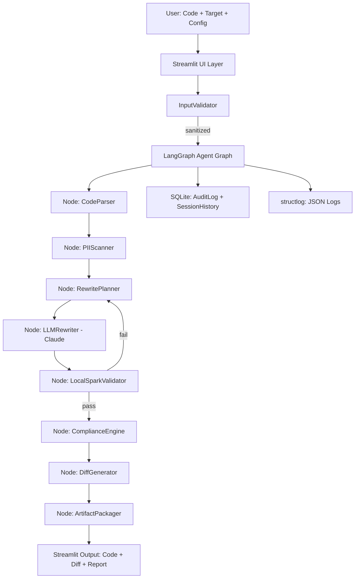

# AI Agentic ETL Optimizer - Complete Design Specification

**Project Name:** AI Agentic ETL Optimizer
**Version:** 2.0
**Date:** March 2026
**Status:** Authoritative specification for implementation
**Purpose:** Comprehensive blueprint for a production-grade AI-powered ETL
optimization system using Streamlit + LangGraph agents + Claude.

---

## 1. Executive Summary

A **Streamlit** web application where users submit a **PySpark script** or
**Prefect flow** (Python). A **Claude-powered LangGraph agent** (via Anthropic
SDK) analyzes, rewrites, and validates it for two cloud-native targets:

- **Target 1:** Snowflake-native (Snowpark Python API)
- **Target 2:** Delta Lake on Spark / Databricks

Automatically embeds **compliance & data-quality gates**: schema validation,
audit logging, idempotency guards, PII detection & masking, lineage tracking,
and Great Expectations-style quality checks.

**MVP delivers in < 2 minutes per optimization cycle:**
- Rewritten, runnable target code
- Unified diff (original vs. rewritten)
- Step-by-step AI reasoning trace
- Compliance report (JSON + Markdown)
- Local Spark dry-run validation result
- Token usage + estimated cost breakdown

**Core Value:** Convert legacy Spark/Prefect jobs into optimized, governed,
cloud-native pipelines with zero manual refactoring and full audit trails.

---

## 2. Project Objectives

| # | Objective | Success Metric |
|---|-----------|----------------|
| O1 | Reduce ETL runtime & cost | 30–70% measured against synthetic benchmark |
| O2 | Embed compliance by design | 100% of outputs pass compliance checklist |
| O3 | Multi-target support | Snowflake AND Delta Lake selectable per run |
| O4 | Transparent AI reasoning | Full reasoning trace stored per session |
| O5 | Data sovereignty | No input code leaves local process unless user opts in |
| O6 | Auditability | Every action logged to append-only SQLite audit table |
| O7 | Reproducibility | Same input + same config → deterministic output hash |

---

## 3. Scope & Out-of-Scope

### In Scope (MVP — Phase 1)
- Input: Single-file PySpark or Prefect Python code (paste or `.py` upload,
  max 10 000 tokens)
- Targets: Snowflake (Snowpark) **or** Delta Lake — one per run
- Output: Rewritten `.py` + unified diff + Markdown report + compliance JSON
- Local validation: PySpark 3.5+ syntax check + dry-run on synthetic data
  (auto-generated from inferred schema)
- LangGraph ReAct agent with Claude 3.5 Sonnet / Claude 3 Opus
- Multi-turn refinement: user can request follow-up changes in-session
- Session history: last 20 runs stored in SQLite with full artifacts
- PII detection: regex + spaCy NER-based scanner with masking stubs in output
- Compliance report covering: GDPR, HIPAA (field-level), SOX audit readiness
- Token budget enforcement with hard stop before exceeding configured limit
- Streamlit export mode: download ZIP of all artifacts

### Out of Scope (Phase 2+)
- Java / Scala / SQL-only jobs
- Multi-file DAGs or projects (>1 entry-point file)
- Live Snowflake / Databricks credential execution
- Automatic GitHub / GitLab PR creation
- Full enterprise PII scanning engine (phase 2)
- Multi-user authentication (phase 2)
- Horizontal scaling / queue-based job dispatch (phase 2)

---

## 4. Tech Stack

### 4.1 Core Stack

| Layer | Choice | Version | Rationale |
|-------|--------|---------|-----------|
| Frontend | Streamlit | ≥ 1.42 | Single-file Python UI, built-in streaming |
| Agent Framework | LangGraph | ≥ 0.2 | Stateful agent graphs; supersedes `create_react_agent` |
| LLM SDK | Anthropic Python SDK | ≥ 0.25 | Direct API, streaming support, tool use |
| LLM Model | Claude 3.5 Sonnet | latest | Best code reasoning/cost ratio in 2026 |
| Fallback LLM | Claude 3 Haiku | latest | Fast cheap fallback for syntax-only tasks |
| Local Execution | PySpark | 3.5.x | Syntax + small-data dry-run validation |
| Flow Parsing | Prefect | 3.x | Parse `@flow` / `@task` decorators |
| Data Quality | Great Expectations | ≥ 0.18 | Schema + quality assertion generation |
| PII Detection | spaCy | ≥ 3.7 | NER-based PII entity recognition |
| Storage | SQLite via SQLAlchemy | ≥ 2.0 | Session/audit history, zero cloud dependency |
| Config | Pydantic Settings | ≥ 2.0 | Typed env-var config with `.env` support |
| Logging | structlog | ≥ 24.0 | Structured JSON logs for observability |
| Metrics | Prometheus client | ≥ 0.20 | Optional `/metrics` endpoint |
| Containerization | Docker + Compose | latest | Reproducible deployment |

### 4.2 Development & Quality

| Tool | Purpose |
|------|---------|
| pytest ≥ 8.0 | Unit + integration tests |
| pytest-asyncio | Async agent test support |
| ruff | Linting + formatting (replaces flake8/black) |
| mypy ≥ 1.9 | Static type checking |
| pre-commit | Git hook enforcement |
| bandit | Security static analysis |
| pip-audit | Dependency vulnerability scanning |

### 4.3 Rationale: LangGraph over LangChain `create_react_agent`

`LangChain.create_react_agent` is a stateless convenience wrapper; it cannot
checkpoint mid-run, resume on failure, or support branching agent logic.
LangGraph provides:
- Explicit state graph with typed `AgentState`
- Built-in checkpointing to SQLite (reuse existing DB)
- Conditional edges for retry/fallback routing
- Streaming node-by-node output to Streamlit

---

## 5. Architecture

### 5.1 High-Level Data Flow



### 5.2 LangGraph Agent State Schema

```python
from typing import Annotated, Literal, TypedDict
from langgraph.graph.message import add_messages


class AgentState(TypedDict):
    session_id: str
    input_code: str
    input_type: Literal["pyspark", "prefect"]
    target: Literal["snowflake", "delta_lake"]
    compliance_profile: str
    token_budget: int
    tokens_used: int
    parsed_structure: dict
    pii_report: dict
    rewrite_plan: str
    rewritten_code: str
    validation_result: dict
    compliance_report: dict
    diff: str
    messages: Annotated[list, add_messages]
    retry_count: int
    error: str | None
```

### 5.3 Agent Tool Registry

| Tool Name | Input | Output | Description |
|-----------|-------|--------|-------------|
| `parse_job` | raw Python code | AST summary dict | Extract transforms, schema, deps |
| `scan_pii` | code + column names | PII report JSON | spaCy + regex PII detection |
| `plan_rewrite` | parsed structure + target | rewrite plan | Claude reasoning step |
| `rewrite_code` | plan + original code | rewritten code | Main LLM rewrite call |
| `validate_spark` | Python code | validation result | Local PySpark dry-run |
| `check_compliance` | rewritten code + profile | compliance JSON | Rule-based compliance checks |
| `generate_diff` | original + rewritten | unified diff string | difflib unified diff |
| `package_artifacts` | all outputs | ZIP bytes | Assemble downloadable bundle |

### 5.4 Retry & Fallback Logic

```
validate_spark FAIL → retry rewrite_code (max 3 attempts)
  └─ after 3 fails → escalate to Claude 3 Opus (one attempt)
       └─ still fail → return partial result with error report

Anthropic API timeout (>30s) → retry with exponential backoff (3x)
  └─ after 3 timeouts → switch to Claude 3 Haiku for skeleton output

Token budget exceeded → truncate input, warn user, proceed with warning flag
```

---

## 6. Input Validation & Security

### 6.1 Input Sanitization Pipeline

All user-submitted code passes through a strict validation gate **before**
reaching the LLM or any execution engine:

1. **Size check:** Reject inputs > 10 000 tokens (Claude tokenizer estimate)
2. **Encoding check:** Validate UTF-8, strip null bytes
3. **Syntax pre-check:** `ast.parse()` — reject if not valid Python
4. **Dangerous pattern scan:** Block `os.system`, `subprocess`, `exec`,
   `eval`, `__import__`, `open(` with write modes, network calls
5. **AST-based import whitelist:** Only allow known data-engineering imports
   (pyspark, pandas, prefect, numpy, etc.)
6. **Path traversal check:** Reject any string literals containing `../`
   or absolute paths outside `/tmp`

> Rejected inputs return a structured error with the specific rule violated.
> **No rejected input ever reaches the LLM.**

### 6.2 Secret Management

- All secrets via environment variables only — never hardcoded
- `.env` file for local dev; Docker secrets / cloud secret manager for prod
- Required env vars validated at startup via Pydantic Settings — app refuses
  to start if `ANTHROPIC_API_KEY` is missing or empty
- `.env` always listed in `.gitignore`; `.env.example` committed instead

### 6.3 API Key Handling

```python
# config.py — enforced at startup
from pydantic_settings import BaseSettings, SettingsConfigDict


class Settings(BaseSettings):
    model_config = SettingsConfigDict(env_file=".env", extra="forbid")

    anthropic_api_key: str
    max_tokens_per_run: int = 8000
    spark_validation_timeout_s: int = 60
    sqlite_path: str = "data/optimizer.db"
    log_level: str = "INFO"
    pii_scan_enabled: bool = True
    compliance_profiles: list[str] = ["gdpr", "hipaa", "sox"]
```

### 6.4 Sandboxed Execution

Local Spark validation runs in a **subprocess with resource limits**:
- `ulimit -v 2097152` (2 GB RAM cap)
- `ulimit -t 60` (60-second CPU cap)
- Working directory: isolated `/tmp/etl_optimizer_{session_id}/`
- Cleaned up after each run via `finally` block
- No network access granted to subprocess

---

## 7. Prompt Engineering Specification

### 7.1 System Prompt (canonical — do not modify without version bump)

```
You are an expert ETL optimization engineer specializing in PySpark,
Snowpark, and Delta Lake. You rewrite data pipelines to be:

1. Cloud-native and optimized for the specified target platform
2. Compliant with {compliance_profile} requirements
3. Production-grade: idempotent, fault-tolerant, observable
4. Free of PII exposure based on the provided PII scan report

Rules you MUST follow:
- Preserve ALL business logic exactly — never change semantics
- Add audit columns: _etl_run_id, _etl_timestamp, _etl_source
- Add schema validation at ingestion boundary
- Replace any detected PII columns with masking stubs
- Include inline comments explaining every non-trivial optimization
- Output ONLY the rewritten Python code block, nothing else
- If the task is impossible, output JSON: {"error": "<reason>"}

Target platform: {target}
Compliance profile: {compliance_profile}
Token budget remaining: {token_budget_remaining}
```

### 7.2 Prompt Versioning

- System prompt stored in `prompts/system_v{N}.txt`
- Version tracked in `Settings.prompt_version`
- Changing system prompt requires incrementing version + updating tests
- Each run logs `prompt_version` to the audit table

### 7.3 Token Budget Strategy

| Model | Input limit | Output limit | Cost guard |
|-------|-------------|--------------|------------|
| Claude 3.5 Sonnet | 6 000 tokens | 2 000 tokens | Hard stop at 95% |
| Claude 3 Haiku | 4 000 tokens | 1 500 tokens | Hard stop at 95% |
| Claude 3 Opus | 8 000 tokens | 3 000 tokens | Escalation only |

Token count estimated via `anthropic.count_tokens()` before each call.
If estimated input > budget: truncate comments from input code, warn user.

### 7.4 Multi-Turn Refinement

Users can request follow-up changes within the same session. The agent
maintains a sliding window of last 6 messages (3 user + 3 assistant) as
context. Full conversation stored in SQLite per session.

---

## 8. Data Models & Storage

### 8.1 SQLite Schema

```sql
-- sessions table
CREATE TABLE sessions (
    id          TEXT PRIMARY KEY,          -- UUID4
    created_at  TEXT NOT NULL,             -- ISO-8601
    input_hash  TEXT NOT NULL,             -- SHA-256 of input_code
    input_type  TEXT NOT NULL,             -- pyspark | prefect
    target      TEXT NOT NULL,             -- snowflake | delta_lake
    status      TEXT NOT NULL,             -- pending|running|success|failed
    tokens_used INTEGER,
    cost_usd    REAL,
    prompt_version TEXT NOT NULL
);

-- artifacts table
CREATE TABLE artifacts (
    id              TEXT PRIMARY KEY,      -- UUID4
    session_id      TEXT NOT NULL REFERENCES sessions(id),
    artifact_type   TEXT NOT NULL,         -- code|diff|compliance|validation
    content         TEXT NOT NULL,         -- raw content
    content_hash    TEXT NOT NULL,         -- SHA-256
    created_at      TEXT NOT NULL
);

-- audit_log table (append-only — no UPDATE/DELETE allowed)
CREATE TABLE audit_log (
    id          INTEGER PRIMARY KEY AUTOINCREMENT,
    session_id  TEXT NOT NULL,
    event_type  TEXT NOT NULL,             -- input_received|pii_found|rewrite_started|...
    event_data  TEXT,                      -- JSON
    timestamp   TEXT NOT NULL,             -- ISO-8601
    severity    TEXT NOT NULL DEFAULT 'INFO'
);

-- pii_reports table
CREATE TABLE pii_reports (
    id          TEXT PRIMARY KEY,
    session_id  TEXT NOT NULL REFERENCES sessions(id),
    entities    TEXT NOT NULL,             -- JSON array of detected entities
    risk_level  TEXT NOT NULL,             -- low|medium|high|critical
    created_at  TEXT NOT NULL
);
```

### 8.2 Compliance Report JSON Schema

```json
{
  "schema_version": "1.0",
  "session_id": "<uuid>",
  "generated_at": "<iso8601>",
  "target": "snowflake|delta_lake",
  "compliance_profiles": ["gdpr", "hipaa", "sox"],
  "overall_status": "pass|warn|fail",
  "checks": [
    {
      "id": "GDPR-001",
      "name": "PII Masking",
      "status": "pass|warn|fail",
      "detail": "...",
      "remediation": "..."
    }
  ],
  "pii_summary": {
    "entities_detected": 3,
    "risk_level": "high",
    "masked_in_output": true
  },
  "audit_columns_added": ["_etl_run_id", "_etl_timestamp", "_etl_source"],
  "idempotency_guard": true,
  "schema_validation": true,
  "lineage_metadata": true
}
```

---

## 9. Compliance Engine

### 9.1 Compliance Rule Set (MVP)

| Rule ID | Profile | Check | Auto-Fix |
|---------|---------|-------|----------|
| GDPR-001 | GDPR | PII columns detected without masking | Yes — add mask stub |
| GDPR-002 | GDPR | No data retention policy comment | Warn only |
| GDPR-003 | GDPR | Cross-border data transfer not flagged | Warn only |
| HIPAA-001 | HIPAA | PHI fields (name, dob, ssn, mrn) unmasked | Yes — add mask stub |
| HIPAA-002 | HIPAA | No encryption-at-rest comment | Warn only |
| SOX-001 | SOX | No audit trail columns | Yes — add audit cols |
| SOX-002 | SOX | Mutable primary key / no idempotency | Yes — add guard |
| ETL-001 | All | No schema validation at entry | Yes — add GE suite |
| ETL-002 | All | Non-deterministic `now()` without seed | Yes — add run_id |
| ETL-003 | All | Unbounded `SELECT *` | Warn — suggest explicit cols |

### 9.2 PII Detection Strategy

1. **Regex patterns:** SSN, email, phone, credit card, IP address
2. **Column name heuristics:** `name`, `email`, `dob`, `ssn`, `phone`,
   `address`, `zip`, `mrn`, `passport`
3. **spaCy NER:** PERSON, ORG, GPE entity extraction from string literals
4. **Risk scoring:** 1–4 scale (Low/Medium/High/Critical) based on entity
   type + exposure surface

PII masking stubs injected into rewritten code:
```python
def mask_pii(value: str, field_type: str) -> str:
    """Mask PII field. Replace with production masking library."""
    raise NotImplementedError(
        f"Implement masking for {field_type} before production deployment"
    )
```

---

## 10. Local Spark Validation

### 10.1 Validation Strategy

The rewritten code is **never directly executed** with real data. Instead:

1. **AST parse:** Confirm output is syntactically valid Python
2. **Import check:** Verify all imports resolve in the local virtualenv
3. **Synthetic schema:** Infer column names/types from parser output →
   generate a 10-row Spark DataFrame matching the schema
4. **Dry-run:** Execute rewritten code against synthetic DataFrame in an
   isolated subprocess (see §6.4 for sandbox limits)
5. **Output check:** Verify output DataFrame has expected columns and no
   runtime exceptions

### 10.2 Validation Result Schema

```python
@dataclass
class ValidationResult:
    passed: bool
    syntax_valid: bool
    imports_valid: bool
    runtime_error: str | None
    output_schema: dict | None
    execution_time_s: float
    synthetic_rows_processed: int
```

---

## 11. Observability & Monitoring

### 11.1 Structured Logging

All logs emitted as JSON via `structlog`. Every log entry includes:
- `session_id`, `timestamp`, `level`, `event`, `module`
- For LLM calls: `model`, `tokens_in`, `tokens_out`, `latency_ms`
- For validation: `validator`, `passed`, `error`

Log levels: `DEBUG` (dev), `INFO` (default), `WARNING` (compliance flags),
`ERROR` (exceptions), `CRITICAL` (security events)

### 11.2 Prometheus Metrics (optional, enabled via `METRICS_ENABLED=true`)

| Metric | Type | Description |
|--------|------|-------------|
| `etl_optimizer_runs_total` | Counter | Total optimization runs |
| `etl_optimizer_runs_success` | Counter | Successful runs |
| `etl_optimizer_llm_tokens_total` | Counter | Cumulative tokens used |
| `etl_optimizer_llm_cost_usd_total` | Counter | Cumulative API cost |
| `etl_optimizer_run_duration_seconds` | Histogram | End-to-end latency |
| `etl_optimizer_validation_failures` | Counter | Spark validation failures |
| `etl_optimizer_pii_detections` | Counter | PII entities found |

### 11.3 Health Check Endpoint

When running with the optional FastAPI sidecar (enabled via
`ENABLE_HEALTHCHECK=true`), expose:
- `GET /health` → `{"status": "ok", "db": "ok", "llm_reachable": true}`
- `GET /metrics` → Prometheus text format

---

## 12. Project File Structure

```
ai-agentic-etl-optimizer/
├── app.py                          # Streamlit entry point
├── config.py                       # Pydantic Settings
├── agent/
│   ├── __init__.py
│   ├── graph.py                    # LangGraph state graph definition
│   ├── state.py                    # AgentState TypedDict
│   ├── nodes/
│   │   ├── __init__.py
│   │   ├── code_parser.py          # AST parsing node
│   │   ├── pii_scanner.py          # PII detection node
│   │   ├── rewriter.py             # LLM rewrite node
│   │   ├── validator.py            # Local Spark validation node
│   │   ├── compliance_engine.py    # Compliance check node
│   │   ├── diff_generator.py       # Diff generation node
│   │   └── artifact_packager.py    # ZIP artifact node
│   └── tools/
│       ├── __init__.py
│       └── spark_runner.py         # Sandboxed Spark subprocess
├── compliance/
│   ├── __init__.py
│   ├── rules.py                    # Rule definitions
│   ├── pii_patterns.py             # Regex + NER patterns
│   └── profiles/
│       ├── gdpr.json
│       ├── hipaa.json
│       └── sox.json
├── db/
│   ├── __init__.py
│   ├── models.py                   # SQLAlchemy ORM models
│   ├── migrations/
│   │   └── 001_initial.sql
│   └── repository.py               # DB access layer
├── prompts/
│   └── system_v1.txt               # Versioned system prompt
├── ui/
│   ├── __init__.py
│   ├── components.py               # Reusable Streamlit components
│   └── session_state.py            # st.session_state management
├── validation/
│   ├── __init__.py
│   ├── input_sanitizer.py          # §6.1 sanitization pipeline
│   └── spark_sandbox.py            # Subprocess sandbox
├── tests/
│   ├── conftest.py
│   ├── fixtures/
│   │   ├── sample_pyspark.py
│   │   └── sample_prefect.py
│   ├── test_input_sanitizer.py
│   ├── test_pii_scanner.py
│   ├── test_compliance_engine.py
│   ├── test_agent_graph.py
│   ├── test_spark_validator.py
│   └── test_db_repository.py
├── data/                           # SQLite DB (gitignored)
├── logs/                           # Log output (gitignored)
├── exports/                        # Generated ZIPs (gitignored)
├── .env.example
├── .gitignore
├── Dockerfile
├── docker-compose.yml
├── pyproject.toml                  # All tool config (ruff, mypy, pytest)
├── requirements.txt
└── README.md
```

---

## 13. API & Interface Contracts

### 13.1 Streamlit Session State Contract

```python
# All keys managed via ui/session_state.py
SESSION_KEYS = {
    "session_id": str,           # UUID, created on first run
    "input_code": str,           # current editor content
    "input_type": str,           # pyspark | prefect
    "target": str,               # snowflake | delta_lake
    "compliance_profile": list,  # selected profiles
    "last_result": dict,         # full agent output
    "history": list,             # list of past session_ids
    "token_budget": int,         # user-set or default
    "refinement_messages": list, # multi-turn conversation
}
```

### 13.2 Agent Graph Public Interface

```python
from agent.graph import build_graph

graph = build_graph()

result: AgentState = await graph.ainvoke({
    "session_id": "uuid",
    "input_code": "...",
    "input_type": "pyspark",
    "target": "snowflake",
    "compliance_profile": "gdpr,hipaa",
    "token_budget": 8000,
})
```

### 13.3 Streaming Interface

LangGraph streams node completions. Streamlit receives events:
```python
async for event in graph.astream(input_state):
    node_name = list(event.keys())[0]
    st.write(f"✓ {node_name} complete")
```

---

## 14. Error Taxonomy

| Code | Name | Cause | User Action | Logged |
|------|------|-------|-------------|--------|
| E001 | InputRejected | Sanitization gate failure | Fix flagged pattern | Yes |
| E002 | TokenBudgetExceeded | Input too large | Trim code or raise budget | Yes |
| E003 | LLMTimeout | Anthropic API >30s | Auto-retry 3x, then fallback | Yes |
| E004 | LLMError | 4xx/5xx from Anthropic | Show user-friendly msg | Yes |
| E005 | ValidationFailed | Spark syntax/runtime error | Return partial + error | Yes |
| E006 | ValidationTimeout | Subprocess >60s | Kill subprocess, warn user | Yes |
| E007 | ComplianceCritical | Critical compliance fail | Block download, force review | Yes |
| E008 | DBError | SQLite write failure | Log, continue in-memory | Yes |
| E009 | PIIScanError | spaCy model load failure | Skip PII scan, warn user | Yes |
| E010 | ArtifactError | ZIP packaging failure | Return raw files instead | Yes |

All errors return a structured `ErrorResponse`:
```python
@dataclass
class ErrorResponse:
    code: str
    message: str
    detail: str | None
    recoverable: bool
    partial_result: dict | None
```

---

## 15. Testing Strategy

### 15.1 Test Coverage Requirements

| Layer | Minimum Coverage | Priority |
|-------|-----------------|----------|
| Input sanitizer | 95% | Critical |
| PII scanner | 90% | Critical |
| Compliance engine | 90% | Critical |
| Agent graph nodes | 80% | High |
| DB repository | 85% | High |
| Spark validator | 75% | High |
| Streamlit UI | 60% (component tests) | Medium |

### 15.2 Test Categories

1. **Unit tests:** Each node, tool, and utility function in isolation
2. **Integration tests:** Full agent graph with mocked LLM (recorded fixtures)
3. **Security tests:** All 6 input sanitizer rules with malicious payloads
4. **Compliance tests:** Each compliance rule fires correctly on synthetic code
5. **Performance tests:** End-to-end run < 120s on reference hardware (M1/M2 Mac)

### 15.3 LLM Test Strategy

LLM calls are **never made in automated tests**. Use:
- `pytest-recording` + VCR cassettes for recorded Anthropic responses
- `unittest.mock.patch` for unit-level node tests
- A dedicated `tests/fixtures/llm_responses/` directory for cassettes

---

## 16. Deployment

### 16.1 Docker

```dockerfile
FROM python:3.12-slim

WORKDIR /app
COPY requirements.txt .
RUN pip install --no-cache-dir -r requirements.txt \
    && python -m spacy download en_core_web_sm

COPY . .

RUN useradd -m appuser && chown -R appuser /app
USER appuser

EXPOSE 8501
HEALTHCHECK CMD curl -f http://localhost:8501/_stcore/health || exit 1

CMD ["streamlit", "run", "app.py", \
     "--server.port=8501", \
     "--server.address=0.0.0.0", \
     "--server.headless=true"]
```

### 16.2 Docker Compose

```yaml
services:
  app:
    build: .
    ports:
      - "8501:8501"
    environment:
      - ANTHROPIC_API_KEY=${ANTHROPIC_API_KEY}
    volumes:
      - ./data:/app/data
      - ./logs:/app/logs
      - ./exports:/app/exports
    restart: unless-stopped
```

### 16.3 Environment Variables

```bash
# .env.example — copy to .env and fill in values

# Required
ANTHROPIC_API_KEY=sk-ant-...

# Optional — defaults shown
MAX_TOKENS_PER_RUN=8000
SPARK_VALIDATION_TIMEOUT_S=60
SQLITE_PATH=data/optimizer.db
LOG_LEVEL=INFO
PII_SCAN_ENABLED=true
COMPLIANCE_PROFILES=gdpr,hipaa,sox
METRICS_ENABLED=false
ENABLE_HEALTHCHECK=false
PROMPT_VERSION=1
```

---

## 17. CI/CD Pipeline

```yaml
# .github/workflows/ci.yml (or equivalent)
stages:
  - lint:       ruff check . && mypy .
  - security:   bandit -r . && pip-audit
  - test:       pytest --cov=. --cov-fail-under=80
  - build:      docker build -t etl-optimizer .
  - scan:       trivy image etl-optimizer
```

All PRs must pass all stages. `main` branch is protected.

---

## 18. Known Risks & Mitigations

| Risk | Probability | Impact | Mitigation |
|------|-------------|--------|------------|
| Claude produces semantically incorrect rewrite | Medium | High | Mandatory user diff review + local validation |
| spaCy misses PII entity | Medium | High | Defense-in-depth: regex + NER + column name scan |
| Input sanitizer false positives block valid code | Low | Medium | Configurable allowlist per org |
| Anthropic API rate limit hit | Low | Medium | Exponential backoff + Haiku fallback |
| SQLite corruption under concurrent writes | Low | Medium | WAL mode + single-writer lock |
| User submits proprietary code accidentally | Medium | High | Prominent data-sovereignty notice on UI |
| LLM cost overrun | Low | Medium | Per-run token cap + cumulative daily limit |

---

## 19. Versioning & Artifact Reproducibility

- Each optimization run generates a deterministic `run_id` = `SHA-256(input_code + target + prompt_version + timestamp_day)`
- Rewritten code artifacts stored with `content_hash` (SHA-256)
- Same input + same config + same prompt version → same `content_hash` (modulo LLM temperature)
- LLM `temperature=0` used for all rewrite calls to maximize reproducibility
- All artifacts retained in SQLite for 90 days (configurable via `ARTIFACT_RETENTION_DAYS`)

---

## 20. Open Questions & Decision Log

| # | Question | Decision | Date | Rationale |
|---|----------|----------|------|-----------|
| Q1 | LangChain vs LangGraph | **LangGraph** | Mar 2026 | Stateful, checkpointable, streaming |
| Q2 | Full PII masking vs stub | **Stub with NotImplementedError** | Mar 2026 | Forces prod teams to implement properly |
| Q3 | SQLite vs PostgreSQL | **SQLite for MVP** | Mar 2026 | Zero infra dependency |
| Q4 | Multi-user auth | **Out of scope Phase 1** | Mar 2026 | Single-user local tool initially |
| Q5 | Java/Scala support | **Phase 2** | Mar 2026 | Python AST tooling only |
| Q6 | Real cloud execution | **Phase 2 opt-in** | Mar 2026 | Data sovereignty default |
| Q7 | Ruff vs flake8+black | **Ruff** | Mar 2026 | 10-100x faster, single tool |
